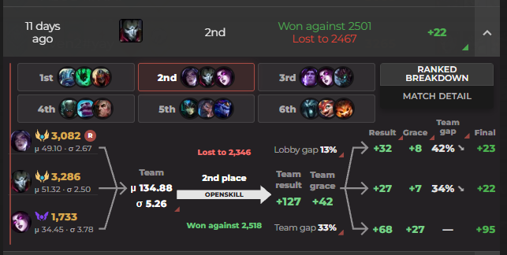

# ArenaSweats Open Source

This repository includes content used for the www.arenasweats.lol website.

**ArenaSweats** is a ranked leaderboard and achievement tracker for LoL Arena gamemode.

The core of ArenaSweats, its ranked leaderboard, is powered by **LOTS** of data. ALL Arena matches of ALL players are tracked **GLOBALLY** (except China) in near real-time.

Once all game data is collected, it goes through a ranking algorithm called **OpenSkill TM**. OpenSkill ThurstoneMosteller model is an industry-leading ranking algorithm with unmatched speed and competitive accuracy. It is a Bayesian ranking algorithm, which is the same as TrueSkill. Such algorithms have been implemented extensively for video game rankings, including by Riot for Summoner's Rift ranked.

## 🎯 ArenaSweats Ranked Principles

Through these **3 principles**, the ArenaSweats ranked algorithm will stay trustworthy and as accurate as possible:

1.  **Use Industry Best System** - Currently OpenSkill TM as the foundation
2.  **Transparent and Open Source** - Every calculation is public and verifiable
3.  **Community-Driven Adjustments** - Any and all adjustments will be decided by the community over on [Discord](https://discord.gg/BvGFJ4WEWg)

This repository's purpose is to bring these principles to life, being the real location where the source code of the LIVE leaderboard ranked algorithm lives.

**This is PROOF of ArenaSweats leaderboard integrity.**

## 🧮 The Current ArenaSweats Ranked Algorithm

### 🎮 The OpenSkill TM Algorithm

ArenaSweats uses **OpenSkill TM**, an industry-leading, battle-tested Bayesian ranking system. Unlike simple win/loss systems, OpenSkill TM is smart about understanding your true skill level.

**Parameters**: Based on player feedback and simulation validation, we currently use:
`return ThurstoneMostellerFull(sigma=(25/5.75), beta=(25/6) * (3.75 in 3v3, 4 in 2v2), tau=(25/300) * 1.75)`

### 📈 Your Skill Profile: Two Numbers That Matter

OpenSkill TM doesn't just track one rating number - it maintains two key pieces of information about every player:

**Your Skill Level (μ "mu")** - This is the system's best guess at your actual skill. Think of it as your "true rating" that goes up when you win and down when you lose.

**Uncertainty (σ "sigma")** - This measures how confident the system is about your skill level. New players start with high uncertainty, but as you play more games, the system becomes more confident in its assessment of your ability.

Sigma has a floor of 2.5. OpenSkill and subsequent ranking modifiers may increase sigma, but the stored post-game sigma never falls below this value.

### ⚙️ Applying OpenSkill TM to Arena

Each Arena match currently has 6 teams of 3 players (18 total players). Here's what happens behind the scenes:

1.  **Before the match**: The system looks at each player's skill level and uncertainty
2.  **Team strength calculation**: Your team's combined strength is calculated by adding the players' skill levels together
3.  **Match prediction**: Based on all 6 teams' strengths, the system predicts how likely each team is to finish in each position (1st through 6th)
4.  **After the match**: Rating changes depend on how your actual performance compared to what was expected

### 🎯 Rating Changes: How to Climb the Ladder

**The BEST way to improve your rating is to finish in a better position against stronger opponents.**

Your rating changes are based on:
- **Expected vs. Actual performance**: Beating stronger teams gives more rating than expected, losing to weaker teams hurts more
- **Uncertainty factor**: Players with higher uncertainty see bigger rating swings (this helps new players find their correct rating faster)

## 🛠️ Community-Driven Adjustments

Arena is a complicated mode (6 teams, duos/trios, boosting pressure, bravery, matchmaking limitations) so a ranking model out of the box will not fit this perfectly. Adjustments are needed on top to keep the leaderboard fair and accurate.

As covered in [Principle #3](#-arenasweats-ranked-principles), ranked adjustments are community-driven and discussed on [Discord](https://discord.gg/BvGFJ4WEWg).

There are currently 3 adjustments in place.

### Repeated Teammates

Some adjustments distinguish between regular teammates and repeated teammates. A current teammate is marked as repeated if they appeared in one of that player's previous few games, or if the pair has played enough games together historically. The historical requirement starts at 3 games together and gradually rises to 7 as that player has more total games.

### Adjustment 1 - Team Gap Modifier

This adjustment applies to teams with at least one GM+ player. It works in this order:

1. Each higher-rated player is compared with every lower-rated teammate.
2. Each comparison uses the repeated-teammate curve if they are repeated teammates, or the regular curve if they are not.
3. The comparison with the strongest reduction is applied to that player.

The modifier works by scaling the higher-rated player's post-match μ change and σ change by a multiplier between 1.0 and 0.05. For repeated teammates, scaling starts at a 10% μ gap and reaches the 0.05 minimum multiplier at a 55% gap. For teammates who are not repeated, scaling starts at 15% and reaches the minimum at 65%. Therefore, the repeated teammate team-gap curve is harsher.

### Adjustment 2 - Unbalanced Lobby Grace

Unbalanced Lobby Grace helps teams with 2 or more GM+ players when matchmaking places them in a much weaker lobby. Without it, these teams would have very little rating to gain and a great deal to lose, which discourages them from queuing up. It works like this:

1. **Lobby gap:** The team's combined μ is compared with the lobby's median team μ. Grace is available only when the team's μ is higher. It uses 22% of this gap in 2v2. In 3v3 it uses 57% through the first 20% of effective lobby gap, then 25% beyond that point.
2. **Team gap:** Teams with a large internal skill gap receive less Grace. In 3v3, the lobby gap is scaled by `(lowest teammate μ / highest teammate μ) ^ 2.5`. As a separate anti-boosting measure, grace is blocked if a higher-μ player has a repeated teammate with μ at least 33% below them.
3. **Player distribution:** OpenSkill first distributes the Grace according to each player's uncertainty (σ). Each player's share is then tilted toward lower-μ teammates using `(lowest teammate μ / player μ) ^ 1.5`, where 1.5 is the current distribution strength (`Q`).

The same distribution is applied separately to μ Grace and σ Grace. The team's total μ Grace is preserved. The total σ Grace is preserved unless enforcing the 2.5 sigma floor limits a player's allocated reduction.

Unbalanced Lobby Grace adds rating overall to offset a matchmaking limitation that would otherwise discourage people from playing. Placement protection can also add rating overall when nobody is eligible to pay for it, as explained below.

### Adjustment 3 - Protection

In order to support solo queue without indirectly buffing boosting, two forms of protection are added:

**AFK Protection** - If a player would lose rating and has a teammate with 0 kills, fewer than 3 assists, and less than 3000 damage dealt, that player's rating loss is ignored for that game. An identified AFK player's own positive rating gain is also reduced to zero.

**Place Protection** - Protection is decided separately for each player. In 3v3, a rating loss is reduced to zero at these placements. Grandmaster+ includes Challenger; teammates exclude the player themselves.

| Your situation | Place protection |
|---|---|
| Below Grandmaster, regardless of teammates | 3rd or better |
| Grandmaster+, with no Grandmaster+ teammates and no repeated teammates | 3rd or better |
| Grandmaster+, with no Grandmaster+ teammates but a repeated teammate | 2nd or better |
| Grandmaster+, with a Grandmaster+ teammate | None |

Protected loss is redistributed to eligible players in 4th-6th place, weighted by placement (6th pays the most, 4th the least). Players who cannot receive placement protection do not pay for it, and players receiving AFK protection are also exempt. If nobody is eligible to pay, placement protection still applies without redistributing the loss. In those games, protection adds rating overall; the game is still processed normally.

### Ranked Breakdown

The Ranked Breakdown on the website shows how each match produced its final rating changes. You can switch between all 6 teams and see their pre-game μ and σ, combined team strength, OpenSkill result, Unbalanced Lobby Grace, Team Gap reduction, protection, and final result.

Each player's adjustments are shown in displayed rating points and add up to their final change. An **R** beside a player means a repeated teammate directly affected one of their adjustments; its tooltip names that teammate and explains the effect.

Use the tooltips for in-depth information and breakdown of ranked concepts.

### 🏆 Your Final Rating

Your displayed rating is calculated as: **round((Skill Level - 3 × Uncertainty) × 75)**

The "conservative estimate" approach (subtracting 3× uncertainty) is a recommended method which means your displayed rating is intentionally lower than your raw skill level - it represents what the system is confident you can achieve consistently.

## 📁 Codebase Highlights

-   **ranking_algorithm.py**: **This is the exact code that is used to update ratings for every game played.** The file is commented with detailed information to explain exactly what the code does, and the code itself is available.
